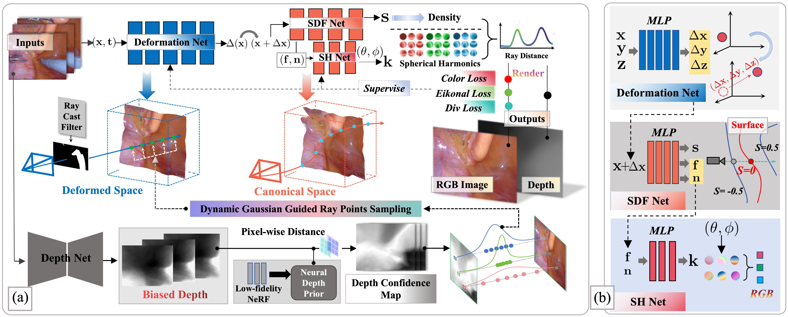

# Endo4SRF:Learning Radiance Field for Dynamic Surface Reconstruction of Surgical Tissues with Obstacle Stealth Under Single-view and Depth-free Monocular Endoscopy
*Bo Lu, Member, IEEE, Chao He, Wenjie Hou, Lijun Han, Hesheng Wang, Senior Member, IEEE,
Lining Sun, Zhaolei Jiang, and Peng Qi, Member, IEEE*

### [[Paper](https://ieeexplore.ieee.org/document/10797692)]

###Pipeline

# Code is coming soon...
